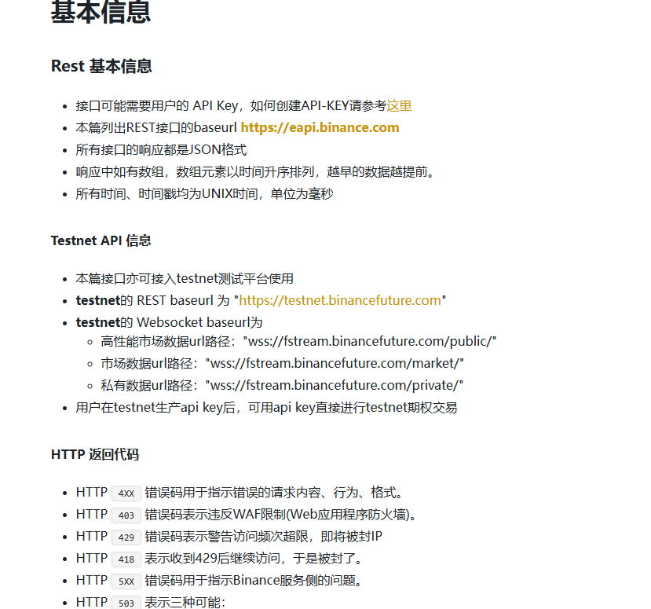

1. 项目概述
1.1 背景
在交易 Binance 期权时，由于市场流动性分布不均（相较于 OKX 等平台），交易者常面临滑点过大、买卖价差宽、无法以合理价格平仓等“流动性陷阱”。官方界面提供的信息维度有限，难以满足专业交易者对多个合约的综合对比需求。

1.2 目标
开发一个轻量级、高度自定义的期权数据筛选与可视化看板。通过直接调用 Binance 公开 API (Public Endpoints)，拉取全量期权数据，计算核心指标（尤其是流动性和性价比指标），以最直观的方式辅助交易者快速定位最佳交易标的。

2. 核心功能需求
2.1 数据获取模块 (Data Fetcher)
接口调用：通过 Binance Options REST API (/eapi/v1/ticker 等公开接口) 定时获取市场快照。无需配置 API Key。

支持币种：覆盖 Binance 期权支持的所有币种（BTC, ETH, BNB, SOL, XRP, DOGE 等）。

数据字段采集：

基础信息：合约名称 (Symbol)、行权价 (Strike)、到期日 (Expiry Date)、看涨/看跌 (Call/Put)。

价格与盘口：标记价格 (Mark Price)、买一价 (Bid 1)、卖一价 (Ask 1)。

交易活跃度：24小时交易量 (24h Volume)、未平仓合约量 (Open Interest, OI)。

高级指标（官方接口自带）：隐含波动率 (IV)、Delta, Gamma, Theta, Vega。

2.2 数据清洗与衍生指标计算 (Data Processing)
这是解决流动性痛点的核心模块，系统需自动计算以下衍生指标：

买卖价差率 (Bid-Ask Spread %)：(Ask - Bid) / Mark Price。用于直观衡量流动性成本，剔除价差离谱的死合约。

到期时间 (Days to Expiry, DTE)：将到期日转化为距离当前的绝对天数，便于评估 Theta 损耗。

Theta 性价比：评估单位期权费所承担的时间价值损耗速度。

2.3 自定义筛选与过滤 (Dynamic Filtering)
用户可以通过界面拖拽或输入参数，实时过滤不符合要求的期权：

流动性过滤：隐藏 持仓量 (OI) < X 或 24小时交易量 < Y 的合约。

价差保护：剔除 买卖价差率 > Z% 的合约。

Greeks 筛选：根据交易策略（如 Delta 中性或买入 Gamma），筛选 Delta 在 [a, b] 区间内的合约。

深度虚值/实值过滤：快速隐藏偏离当前现货价格过远的深度 OTM 或 ITM 合约。

2.4 可视化展示 (Visualization Dashboard)
摒弃繁杂的代码终端，提供直观的图形用户界面 (GUI)：

增强版 T 型报价表 (Option Chain)：以行权价为中心，左 Call 右 Put。高亮显示流动性极佳（价差极小）的合约档位。

多维数据散点图 (Scatter Plots)：

X轴为行权价，Y轴为 IV（直观展示波动率微笑/偏斜）。

X轴为行权价，Y轴为买卖价差率（一眼看出哪些行权价存在流动性断层）。

3. 技术栈建议

nextjs+Tailwind CSS + Shadcn/ui + fastapi (如果需要)+sqlite（如果需要）

# okx
1. 模块概述1.1 背景OKX 是全球流动性极佳的加密货币期权市场之一，但其采用的是“币本位（Coin-Margined）”结算，计价单位为底层资产（如 BTC/ETH）。为了与 Binance 的“U本位”期权在同一个看板中进行直观对比，系统需要引入 OKX 数据源，并进行核心的“汇率”转换与数据标准化。1.2 目标无须 API Key 获取 OKX 全量期权市场快照，将币本位价格实时折算为美元（USD）价值，最终实现 Binance 与 OKX 在同一行权价、同一到期日下的“同台竞技”，直观暴露两者的流动性差异和定价偏差。2. 数据获取需求 (OKX Data Fetcher)接口版本：使用 OKX REST API V5。公共接口调用：GET /api/v5/public/instruments：获取期权合约的基础信息（到期日、行权价、乘数）。GET /api/v5/market/tickers：获取所有期权的最新盘口价格（Bid/Ask）、24小时交易量和持仓量。GET /api/v5/public/mark-price：获取带 Greeks（Delta, Gamma, Vega, Theta）和隐含波动率（IV）的标记价格数据。GET /api/v5/market/index-tickers：关键接口，获取底层资产的实时指数价格（如 BTC-USD），用于后续的价格折算。3. 数据转换与标准化核心逻辑 (Data Standardization - 重中之重)这是跨平台对比的灵魂所在，必须在系统后台完成以下“翻译”工作：统一命名规则 (Symbol Mapping)：OKX 格式：BTC-USD-240329-70000-CBinance 格式：BTC-240329-70000-C处理：系统需提取出共同特征（标的、到期日、行权价、看涨/看跌），生成看板专用的统一 ID。价格与价值统一 (Premium Conversion)：OKX 盘口报价（如 0.05 BTC） $\rightarrow$ 乘以实时 BTC-USD 指数价格 $\rightarrow$ 转换为 USD 绝对价值（如 $3500）。规则：所有涉及钱的字段（Mark Price, Bid 1, Ask 1），在前端展示前，必须全部统一为 USD 价值。流动性深度统一 (Size Conversion)：OKX 的交易量/持仓量通常以“张（Cont）”为单位（1张 = 0.1 BTC 或 1 ETH 等，具体看合约乘数）。Binance 通常直接以“币的数量（BTC）”为单位。规则：将 OKX 的“张数”乘以“合约乘数”，统一换算成以 BTC/ETH 数量为单位的绝对持仓量。4. 跨平台对比面板功能 (Cross-Exchange Dashboard)在前端界面新增“跨平台比价”视图：聚合 T 型报价表 (Aggregated Option Chain)：在同一个行权价下，分上下两行（或左右分列）展示 Binance 和 OKX 的数据。价差监控 (Spread Arbitrage Monitor)：跨平台差价率：计算 (OKX Ask - Binance Bid) 或 (Binance Ask - OKX Bid)。如果出现负数或极小的值，通过颜色高亮（这通常意味着无风险套利机会或极佳的单边建仓时机）。流动性对比器 (Liquidity Radar)：对比两者的 买卖价差比 (Bid-Ask Spread %)，只显示两个平台中流动性更好（价差更窄）的那一个报价，并在旁边打上平台 Logo 标签。5. 性能与限制说明速率限制 (Rate Limits)：OKX 的公共 API 限制通常为 20次/2秒。由于拉取的是全量数据（包含数百个合约），需确保 Python 脚本不要频繁死循环请求，建议采用 3-5 秒一次的轮询节奏。